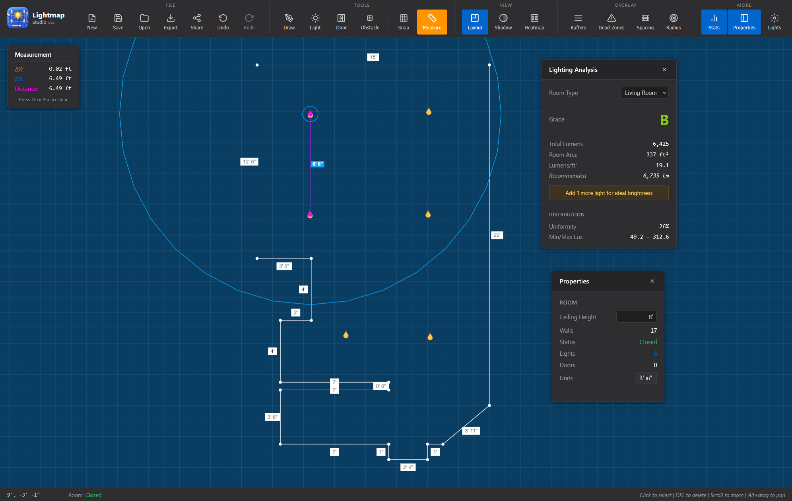

# Lightmap Studio

A 2D lighting design and analysis tool developed as a personal project to assist with home renovation planning, allowing users to create room layouts, place light fixtures, and perform real-time illuminance calculations using IES photometric data. It can also be a useful solution for anyone planning lighting layouts for their home or small-scale projects.



## Features

### Room Design

- **Interactive Drawing Tools** - Create room layouts with walls, rafters, doors, and obstacles
- **Snap-to-Grid** - Precise positioning
- **Measurement Tools** - Real-time distance and dimensions measurements
- **Undo/Redo** - Full editing history

### Lighting Analysis

- **IES Photometric Support** - Import industry-standard IES files
- **Real-time Calculations** - Calculate illuminance, luminance, and other lighting metrics
- **Heatmaps** - Visualize lighting distribution and identify areas of low illumination
- **Dead Zone Detection** - Identify areas of the room that are not well-li
- **Spacing Analysis** - Automatic detection of fixture spacing issues
- **Light Statistics** - Comprehensive metrics including average lux, uniformity ratios, and coverage

### Tools

- **Custom Light Definitions** - Create and manage fixture libraries with lumen output and beam angles
- **Property Panel** - Edit fixture properties, positions, and photometric data
- **Multiple View Modes** - Switch between design and analysis views
- **Auto-save** - Automatic persistence to browser local storage
- **Theme Support** - Dark and light mode support

### Usage

### Keyboard Shortcuts

| Key                       | Action                                                            |
| ------------------------- | ----------------------------------------------------------------- |
| `D`                       | Switch to Draw mode                                               |
| `V`                       | Switch to Select mode                                             |
| `L`                       | Switch to Light placement mode / Set manual length (in draw mode) |
| `M`                       | Toggle measurement tool                                           |
| `S`                       | Toggle grid snap                                                  |
| `Esc`                     | Cancel current operation / Clear measurement                      |
| `Ctrl+Z`                  | Undo                                                              |
| `Ctrl+Y` / `Ctrl+Shift+Z` | Redo                                                              |

### Drawing a Room

1. Press `D` to enter Draw mode
2. Click to place wall points
3. Press `L` to manually enter wall lengths
4. Complete the room by connecting back to the start point

### Placing Lights

1. Press `L` to enter Light placement mode
2. Click to place fixtures
3. Use the Property Panel to adjust:
    - Lumen output
    - Beam angle
    - Ceiling height
    - Fixture names

### Analyzing Lighting

1. Open the Lighting Stats panel to view:
    - Average illuminance (lux)
    - Minimum/maximum lux values
    - Uniformity ratios
    - Coverage percentage
2. Enable heatmap view to visualize light distribution
3. Configure dead zone thresholds to identify under-lit areas
4. Review spacing warnings for fixture placement issues

### Importing IES Files

Lightmap Studio supports industry-standard IES photometric data files:

1. Open the Light Definition Manager
2. Click "Import IES File"
3. Select your `.ies` file
4. The parser extracts lumen values and calculates beam angles automatically

### Tech Stack

- **Svelte** - UI framework
- **Three.js** - 3D rendering and calculations
- **Typescript** - Language
- **Vite** - Build tooling and bundler
- **Vitest** - Testing framework

### Installation

```bash
npm install
```

### Development

```bash
npm run dev
```

Open browser to `http://localhost:5173`

### Production

```bash
# Production bundle
npm run build

# Production preview build
npm run preview
```

### Testing

```bash
npm run test

# Run tests in watch mode
npm test

# Run tests once
bpm run test:run
```
